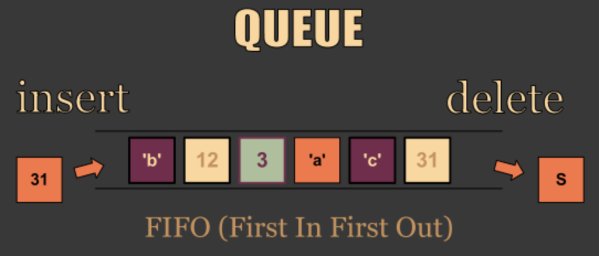

# 큐(Queue)

## 1. 큐의 구조

- 줄을 서는 행위와 유사
- 가장 먼저 넣은 데이터를 가장 먼저 꺼낼 수 있는 구조 = 선입선출
- FIFO(First-In, First-Out) = 선입선출 또는 LILO(Last-In, Last-Out)
    
    
    

## 2. 알아둘 용어

- Enqueue: 큐에 데이터를 넣는 기능
- Dequeue: 큐에서 데이터를 꺼내는 기능
- 참고 링크: [https://visualgo.net/en/list](https://visualgo.net/en/list)

## 3. Java에서 큐 자료구조 사용하기

- Java에서 기본적으로 `java.util` 패키지에 `Queue` 클래스 제공
    - Enqueue에 해당하는 기능으로 `add(value)` 또는 `offer(value)` 메서드 제공
    - Dequeue에 해당하는 기능으로 `poll()` 또는 `remove()` 메서드 제공
    - Queue 클래스에 데이터 생성을 위해서는 `java.util` 패키지에 있는 `LinkedList` 클래스를 사용해야함
    - `add` vs `offer`
        
        |  | 예외 발생 (null) | 값 리턴 (true or false) |
        | --- | --- | --- |
        | 추가(Enqueue) | add(value) | offer(value) |
        | 삭제(Dequeue) | remove() | poll() |
        | 검사(peek) | element() | peek() |

- Queue 클래스 사용해보기
    
    ```java
    // Queue를 사용하기 위해 Queue 클래스 및 LinkedList 클래스 둘 다 import
    import java.util.LinkedList;
    import java.util.Queue;
    
    // 자료형 매개변수를 넣음으로써 큐에 들어갈 데이터 타입 지정
    Queue<Integer> queue_int = new LinkedList<Integer>();
    Queue<String> queue_str = new LinkedList<String>();
    ```
    
    ```java
    // 데이터 추가는 add(value) 또는 offer(value) 사용
    queue_int.add(1);
    queue_int.offer(2);
    
    System.out.println(queue_int);
    // [1, 2]
    
    // poll()은 큐의 첫번째 값 반환 & 해당 값은 큐에서 삭제
    queue_int.poll();
    // 1
    
    System.out.println(queue_int);
    // [2]
    
    // remove()역시 첫번째 값 반환 & 해당 값은 큐에서 삭제
    queue_int.remove();
    
    System.out.println(queue_int);
    // []
    ```
    

## 참고: 큐가 많이 쓰이는 곳

- 멀티태스킹을 위한 프로세스 스케쥴링 방식을 구현하기 위해 많이 사용


## 4. 프로그래밍 연습

- Java ArrayList 클래스를 활용해서 큐를 다루는 enqueue, dequeue 기능 구현하기
- dequeue 기능 호출 시, 큐에 데이터가 없는 경우 null 리턴
- 다양한 데이터를 다룰 수 있도록, Java generic타입 문법 활용
    
    ```java
    import java.util.ArrayList;
    import java.util.Arrays;
    
    public class myQueue<T> {
    
        private ArrayList<T> queue = new ArrayList<T>();
    
        public void enqueue(T item) {
            queue.add(item);
        }
    
        public T dequeue() {
            if (queue.isEmpty()) {
                return null;
            }
            return queue.remove(0);
        }
    
        public boolean isEmpty() {
            return queue.isEmpty();
        }
    
        public static void main(String[] args) {
            myQueue<Integer> mq = new myQueue<>();
    
            mq.enqueue(1);
            mq.enqueue(2);
            mq.enqueue(3);
            System.out.println(mq.dequeue());
    				// [1]
        }
    }
    ```